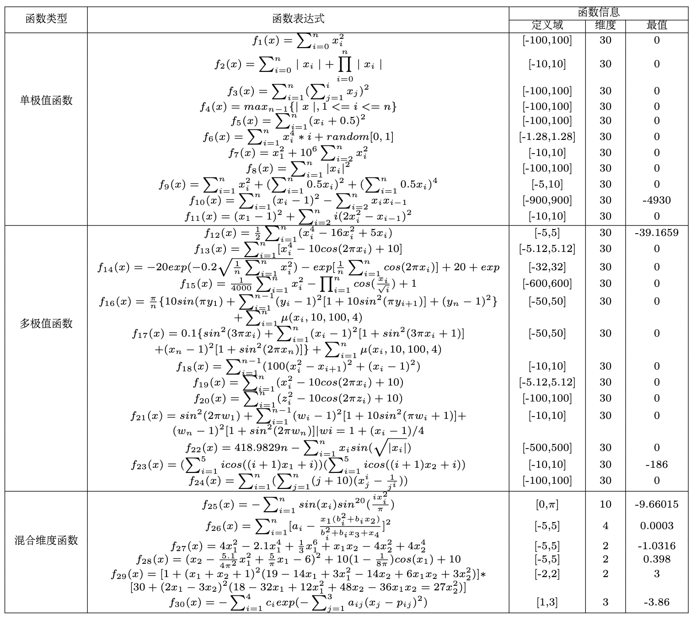

# 测试函数

为了评价果蝇优化算法的好坏，测试算法的收敛能力，估计算法寻找最优解数量级，引入测试函数。测试函数分为三种类型，第一种为在定义域的范围内只存在一个极值的单极值函数（Unimodal function），第二种为存在多个极值的多极值函数（Multimodal function），第三种为维度不恒等于30的混合维度函数（Fixed-dimension multimodal function）。对于单极值和多极值函数，维度均为30。测试函数的类型、表达式、定义域、维度、最值信息如下如图所示。

这些测试函数大多从这两处找到：

https://blog.csdn.net/jiang425776024/article/details/87358300

http://www.sfu.ca/~ssurjano/optimization.html