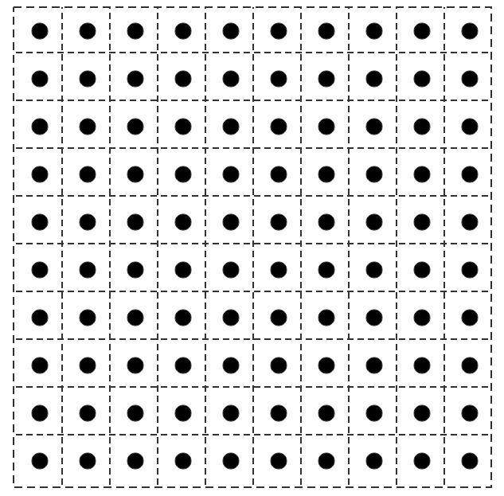

# FOA_Graduation_Project

***

> 前言：本科的毕业设计是做的和果蝇算法相关的工作，虽然论文是垃圾，但确实也把这个算法的基本原理的给弄懂了，本篇文章用于记录一下，这样既给小白指导，当未来的我还需要用到这个算法的时候也可以看一下。使用MATLAB实现

***


## 1 什么是果蝇算法

果蝇算法是一位叫做潘文超的台湾教授提出的一种算法，能够用来找到优化问题的解。本质上是模拟了果蝇群体搜索食物的过程，是一种群体智能算法。

## 2 果蝇算法基本原理

果蝇算法实际上非常简单，整个算法流程仅仅包含2个步骤，原因是果蝇群体搜索食物的过程分为两个阶段，第一个阶段为嗅觉搜索，第二个阶段是视觉搜索。

果蝇群体搜索食物的过程是这个样子的：

- Step 1：嗅觉搜索

  果蝇个体通过嗅觉判断食物的大致方位，然后向周围的果蝇个体发出气味信息，报告自己得出的食物位置。在这之后果蝇个体接受从周围个体传递过来的食物信息，并且和自己得出的信息相互比较，判断哪一个果蝇个体得出的位置信息更加精确，这一过程将持续到所有果蝇个体得到统一的位置信息.

- Step 2：视觉搜索

  随着所有果蝇个体得出结论一致之后，所有果蝇通过视觉找到发现该位置的果蝇个体，并且聚集到该果蝇个体附近。

## 3 果蝇算法流程

果蝇算法流程最好结合代码才能弄明白，下面结合代码来讲解果蝇算法流程，代码流程划分为4个步骤

### 1、初始化算法参数

首先需要初始化果蝇算法的一些特定参数，如下表所示

|          参数名          |        参数含义        |
| :----------------------: | :--------------------: |
|    `population_size`     |      果蝇种群大小      |
|     `max_iteration`      |      最大迭代次数      |
|       `dimension`        |     果蝇坐标的维度     |
|    `max_fly_distance`    | 每只果蝇的最长飞行步长 |
| `coordinate_left_board`  |  果蝇坐标的范围最小值  |
| `coordinate_right_board` |  果蝇坐标范围的最大值  |

有了果蝇坐标的范围的最小值和最大值，就可以计算出果蝇坐标范围和坐标偏移（所谓坐标偏移就是一个用来方便使用rand函数的参数）

```matlab
coordinate_range=(coordinate_right_board-coordinate_left_board)/2;              %坐标的范围
coordiante_offset=(coordinate_right_board-coordinate_range);                    %坐标距离原点的偏移程度
```

有了`coordinate_range`和`coordinate_offset`以及`dimension`之后就可以使用MATLAB中的rand函数随机生成初始化一只果蝇的坐标了，这里注意仅仅是一只果蝇，有同学问，难道不是果蝇群体吗？请接着看嗅觉搜索部分

```matlab
X_axis=coordinate_range*(2*(rand(1,dimension)-1/2))+coordiante_offset;
Y_axis=coordinate_range*(2*(rand(1,dimension)-1/2))+coordiante_offset;
```

看到这里有的同学可以会有疑惑，举个例子就好理解了，比如说维度在30，范围是[-10, 20]的果蝇群体是这样子生成的

- 首先`rand(1, dimension)`生成一个1*30的矩阵，矩阵中的每一个元素均为(0,1)中的随机数
- `rand(1,dimension)-1/2`之后矩阵中的每一个元素就成了(-0.5, 0.5)的随机数
- `2*(rand(1,dimension)-1/2)`之后矩阵中的每一个元素就成了(-1, 1)的随机数
- `coordinate_range*(2*(rand(1,dimension)-1/2))`之后矩阵中的每一个元素就成了(-15, 15)的随机数，因为`coordinate_range`计算结果为15
- `coordinate_range*(2*(rand(1,dimension)-1/2))+coordiante_offset`之后矩阵中的每一个元素就成了(-10, 20)的随机数，因为`coordinate_offset`计算结果为5

### 2、果蝇群体嗅觉搜索

虽然果蝇可以通过嗅觉来大致判断食物的位置，但是我们的算法可做不到使用真正的嗅觉，所以我们使用的是随机性。

首先生成真正的果蝇群体，之前只是生成了一只果蝇，然后让这个果蝇群体的坐标加上一个随机值，然后判定每只果蝇的适应度，所谓适应度就是，这只果蝇代表的解的优秀程度。

我将嗅觉搜索封装成了一个函数，如下所示

```matlab
%输入参数：果蝇群体坐标(X_axis && Y_axis)，果蝇种群大小，果蝇种群坐标维度，果蝇种群单词移动最大步长
%输出参数：果蝇种群嗅觉搜索之后新坐标(X && Y)，果蝇群体的味道浓度判定值Si
%注意我这里忘记限制了果蝇坐标的范围，详见FOA_version4改进果蝇算法工程问题
%% version：1.0 last update:2022/4/13 author:hanjie-chen

function [Smell_i,X,Y]=Smell_Search_Function(X_axis,Y_axis,population_size,dim,L)
%     初始化参数，使其成为两个population_size*dim的全0数组
    origin_distance=zeros(population_size,dim);
    Smell_i=zeros(population_size,dim);
%     扩充种群坐标
    X_axis=repmat(X_axis,population_size,1);    
    Y_axis=repmat(Y_axis,population_size,1);
%     嗅觉搜索：让果蝇随机飞行之后 求出每个果蝇的坐标矩阵;
    X=X_axis+L*(2*(rand(population_size,dim)-1/2));  
    Y=Y_axis+L*(2*(rand(population_size,dim)-1/2));
%     求出所有果蝇个体距离原点的距离sqrt(Xi^2+Yi^2)
    origin_distance=(X.^2+Y.^2).^0.5; 
%     求出所有果蝇的味道浓度判定值Si=1/origin_distance
    Smell_i=1./origin_distance;  
end
```

### 3、果蝇群体视觉搜索

视觉搜索就非常简单了，只需找到具有最佳适应度的果蝇的下标即可，然后全体果蝇向这只果蝇靠齐，我们拿来判断适应度的东西称之为适应度判定函数`Fitness_Function`

```matlab
% 视觉搜索同时找到最佳适应度果蝇个体
[BestSmell,Index]=Fitness_Function(Smell_i);
% 取得最优个体的两个维度的X,Y坐标，其余果蝇的坐标像这个位置集中
X_axis=X(Index,:);
Y_axis=Y(Index,:);
```

### 4、迭代

然后就进行愉快的for循环了，一直重复嗅觉搜索和视觉搜索，知道迭代完成

```matlab
%% 迭代循环
for iteration_turn=1:max_iteration
    %% 嗅觉搜索
    [Smell_i,X,Y]=Smell_Search_Function(X_axis,Y_axis,population_size,dimension,max_fly_distance);
    %% 视觉搜索
    [BestSmell,Index]=Fitness_Function(Smell_i);
%   如果本次搜索发现适应度更好，那么更新位置
    if BestSmell<SmellBest
        X_axis=X(Index,:);
        Y_axis=Y(Index,:);    
%       更新极值
        SmellBest=BestSmell;
    end
%   记录每次迭代的最优值和坐标
    Smell_best(iteration_turn)=SmellBest;
end
```

有了这些知识就可以写出原始果蝇算法了，并且使用30个测试函数代表适应度函数来测试原始果蝇算法的效果，我把原始果蝇算法的完整代码和测试函数的说明放到了github上面的[仓库](https://github.com/hanjie-chen/FOA_Graduation_Project)其中的FOA_version1：原始果蝇算法测试函数。

## 4 果蝇算法改进

我当时只改进一个地方，就是每只果蝇的最长飞行步长`max_fly_distance`这个，因为在原始果蝇算法中这个参数是一个固定值，当该步长取较大值时，果蝇的搜索范围较大，即果蝇的全局搜索能力强；该值取较小值时，果蝇的搜索范围较小，即果蝇的局部搜索能力强。

### 1、改进一

我是这样子的想的，首先这个步长应该和适应度函数的取值范围有关，例如，对于一个坐标取值范围为[-100,100]的适应度函数，步长取值为1；而第二个适应度函数的坐标取值范围为[-5,5]的测试函数，步长取值也为1。从中看出第二个测试函数的步长设置较第一个更大一些。

所以对果蝇单次最长飞行步长（max_fly_distance）的第一个改进就是，使其初始值和坐标范围(`coordiante_range`)绑定，为坐标范围的百分之一

```matlab
max_fly_distance_initial = coordiante_range / 100
```

但是这个值不能太小，比如[-5,5]的取值范围就只剩下0.05了，所以我设置了下限1

### 2、改进二

其次这个值最好是动态变化的，在搜索前期在全局搜索，找到一个较好的区域之后，在进行更加精确的局部搜索，即前期步长要比后期更长。我想让他随着迭代次数增加而下降，于是想到了如下公式

```matlab
max_fly_distance_dynamic = parameter * (1-iteration_turn/iteration_max) * max_fly_distance_initial
```

其中`iteration_turn`是当前迭代次数，`iteration_max`是最大迭代次数`parameter`是一个参数，用于调整大小。我将其设置为

```matlab
parameter = coordinate_range / 10;
```

同理这个值不能太小，否则就没有意义了，设置了下限10

综上所述，完整的代码是

```matlab
%% 动态步长调整函数
% 输入参数：当前迭代次数，最大迭代次数，当前步长
% 输出参数：修正之后的步长
% 为什么parameter最小是10，我是自己试出来的，我也不知道。max_fly_distance_initial最小是1也是同理
% version:0.0 author:hanjie-chen 2022/4/18

function [max_fly_distance_cruuent] = Dynamic_Fly_Distance(iteration_turn, iteration_max, max_fly_distance_initial, coordinate_range)
    parameter = coordinate_range / 10;
    if parameter < 10
        parameter = 10;
    end
    if max_fly_distance_initial < 1
        max_fly_distance_initial = 1;
    end
    max_fly_distance_cruuent = parameter*(1-(iteration_turn/iteration_max))*max_fly_distance_initial;
end
```

我把改进果蝇算法的完整代码和测试函数（同原始果蝇算法）放到了github上面的[仓库](https://github.com/hanjie-chen/FOA_Graduation_Project)其中的FOA_version2：改进果蝇算法测试函数。其中测试函数和FOA_version1是一样的，只要看version1中关于测试函数的说明就好了。

## 5 例子：果蝇算法在工程问题上面的应用

其实我也不知道我对这个工程问题的建模是否正确，感觉是有点问题的，所以这个工程问题的背景我就不在概述了，直接说我如何使用果蝇算法求解我建立的模型。

### 1、模型介绍



假设目标指定区域是一个二维的正方形平面，其边长设置为100，将其平均划分400份，每一份均为边长为5的小正方形（上图只有100份，但是大概是这个平均划分的意思），每份中心存在一个用户节点（图片中的小黑点）。存在36个连接节点，对于第i个连接节点，其位置设置为（Xi, Yi）,其中Xi和Yi的取值范围均为[0,100]。连接节点的功率为Pi取值范围为[1,24]，连接节点和用户节点之间的通讯功率存在一个下限（P_min），如果AP节点与用户节点之间的通信功率低于该下限则被认为两个结点之间通讯不存在。只要用户节点收到任何一个连接节点的信号功率大于等于最低功率P_min，就可以认定这个用户节点被连接。

信号在传输过程中总会有一定损耗，本文假设传播损耗满足以下公式


$$
\beta=\alpha+10\gamma lg \frac{d}{d_0}+\beta_s
$$


|    符号     |           含义            |       取值       |
| :---------: | :-----------------------: | :--------------: |
|   `P_min`   |       最低通信功率        |    -70（dBm）    |
| $$\beta_s$$ |    由障碍物引起的损耗     |       14.6       |
| $$\gamma$$  |       路径损耗程度        |        3         |
|    $$d$$    | 连接节点到用户节点的距离  | 每个结点具体计算 |
|   $$d_0$$   |         基准距离          |        1         |
| $$\alpha$$  | 作为基准距离$$d_0$$的功率 |        10        |

如果第i个连接节点的发射功率减去到达第j个用户节点的传播损耗依然大于最低功率（P_min），则认为该用户节点被连接节点覆盖了。即判断公式如下


$$
P_i-\beta_{ij}\geq P_{min}
$$


36个连接节点对用户节点的覆盖率由如下公式计算


$$
CoverageRate=\frac{1}{100}\sum_{i=1}^{36}\sum_{j=1}^{400}Judge(连接节点i,用户节点j)
$$


本文的优化目标可以表达为既要能够保证较高的覆盖率的同时又要AP节点的总功率较低，然而在实际情况下对用户群体节点做到100%的覆盖是困难的，故允许存在没有覆盖到的用户节点，采用unconnected_pln_number表示在400个用户结点中没有被AP接地那覆盖的用户群体节点数量，对最后的结果引入平方作为适应度函数的一部分，其系数经过多次测试定位为1000。适应度函数的公式如下


$$
min(\sum_{i=1}^{36}P_i+1000*未连接用户节点数量^2)
$$


这个模型需要求解的是，这36个连接节点在这个平面区域的坐标和功率，要求功率尽可能第，对用户节点的覆盖率尽可能高。

**其实这已经算是一个多目标优化问题了，只不过我将其变成了单目标，好像多目标优化有自己特定的方式，我这样子是有问题的。**

### 2、原始果蝇算法实现

首先是需要将每只果蝇表达为一个解，于是每只果蝇的坐标分为三个部分，36个节点的X轴坐标，Y轴坐标，功率的大小

初始化这三个部分

```matlab
%% 初始化坐标和功率；
X_axis=100*rand(1,aln_number);
Y_axis=100*rand(1,aln_number);
P_axis=ones(1,aln_number)*24;
```

这里注意我对嗅觉搜索部分的代码有所修改，详见注释

```matlab
%输入参数：单只果蝇坐标(X_axis && Y_axis && P_axis)，果蝇种群大小，果蝇种群坐标维度，果蝇种群单词移动最大步长
%输出参数：果蝇种群嗅觉搜索之后新坐标(X && Y)
%本修改之后的函数用于真实情况建模
%其实这个地方已经不算是经典的果蝇算法了，因为我让第一只果蝇保存上一次果蝇群体找到的的最优值，然经典的果蝇算法是不保存的。
%% version：4.0 last update:2022/4/28 author:hanjie-chen

function [X,Y,P]=Smell_Search_Function(X_axis,Y_axis,P_axis,population_size,dim,L)
%     初始化X,Y,P三个population_size*36的果蝇群体
    X=zeros(population_size, dim);
    Y=zeros(population_size, dim);
    P=zeros(population_size, dim);
%     将种群坐标扩充 即X_axis(1,:)表示果蝇的其中一部分坐标。
    X_axis=repmat(X_axis,population_size,1);    
    Y_axis=repmat(Y_axis,population_size,1);
    P_axis=repmat(P_axis, population_size,1);
%     让第一只果蝇保存上一次果蝇群体找到的的最优值
    for j=1:dim
        X(1,j)=X_axis(1,j);
        Y(1,j)=Y_axis(1,j);
        P(1,j)=P_axis(1,j);
    end
%     嗅觉搜索：让果蝇随机飞行之后 求出每个果蝇的坐标矩阵;
%     因为果蝇一开始在集中在一个坐标上，在其基础之上进行嗅觉搜索    
    for i=2:population_size
        for j=1:dim
            X(i, j)=X_axis(i, j)+L*(2*(rand-1/2));
            Y(i, j)=Y_axis(i, j)+L*(2*(rand-1/2));
            P(i, j)=P_axis(i, j)+L*(2*(rand-1/2));
        end
    end
%     限制果蝇的搜索的边界，如果超出边界那么直接赋值为边界值
    for i=2:population_size
        for j=1:dim
            if X(i,j) > 100 || X(i, j) < 0
                X(i, j) = Limit_Board(X(i, j), 0, 100, L);
            end
            if Y(i,j) > 100 || Y(i, j) < 0
                Y(i, j) = Limit_Board(Y(i, j), 0, 100, L);
            end
            if P(i, j) > 24 || P(i, j) < 1
                P(i, j) = Limit_Board(P(i, j), 1, 24, L);
            end
        end
    end
end
% 边界限制函数，如果超出边界那么直接赋值为边界值
function [right_value]=Limit_Board(base, left_board, right_board, L)
if base > right_board
    right_value=right_board;
end
if base < left_board
    right_value=left_board;
end
end
```

还有一个需要注意的点是适应度函数的实现，其中我们输入的参数`P_min`的单位是分贝（dBm）最终将其转换到为毫瓦（mW）

具体代码如下：

```matlab
% 400个用户和36个AP节点的适应度函数
%% version:2.0 author:hanjie-chen last update:2022/5/11
function [BestSmell, Index, Coverage_Rate, Total_Power] = Fitness_Function(X_axis, Y_axis, P_axis, P_min, population_size, aln_number)
% 计算每只果蝇的覆盖率，每只果蝇的未覆盖节点个数，其结果为一个大小为population_size的以为数组
[Coverage_Rate_Group, unconnected_pln_number] = Calculate_Coverage_Rate(X_axis, Y_axis, P_axis, P_min, population_size, aln_number);
% Smell为其适应度函数值 Total_Power是总功率
Smell = zeros(1, population_size);
Total_Power_Group = zeros(1, population_size);
% 计算每只果蝇得出的功率 转换单位dBm到mW
for i=1:population_size
    for j = 1:aln_number
        Total_Power_Group(i) = Total_Power_Group(i) + power(10, P_axis(i,j)/10);
    end
%     加上惩罚项系数1000*aln_number^2
    Smell(i)=Total_Power_Group(i)+1000*(unconnected_pln_number(i)^2);
end
[BestSmell, Index]=min(Smell);
Coverage_Rate = Coverage_Rate_Group(Index);
Total_Power = Total_Power_Group(Index);
end

function [Coverage_Rate_Group, unconnected_pln_number] = Calculate_Coverage_Rate(X_axis, Y_axis, P_axis, P_min, population_size, aln_number)
alpha = 50;
gamma = 3;
d0 = 1;
beta_s = 14.6;

connected_number_group = zeros(1, population_size);
Coverage_Rate_Group = zeros(1,population_size);
unconnected_pln_number = zeros(1, population_size);

for k=1:population_size
%     初始化每只果蝇的连接数量为0
    connected_number = 0;
%     计算第k只果蝇的第j个汇聚层节点是否和第i个感知层节点是否有连接
    for i = 1:400
        for j = 1:aln_number
%             计算第k只果蝇第j个汇聚层结点和第i个感知层节点的距离d
            d = Calculate_Distance(X_axis(k, j), Y_axis(k, j), i);
%             计算传播损耗beta
            beta = alpha+10*gamma*log10(d/d0)+beta_s;
%             如果减去传播损耗依然大于最低通信限度，则说明两者存在连接，退出汇聚层节点循环，判断下一个感知层节点
            if (P_axis(k, j)-beta > P_min)
                connected_number = connected_number + 1;
                break;
            end
        end
    end
%     第k只果蝇的感知层节点连接数，未连接数，覆盖率
    connected_number_group(k)=connected_number;
    unconnected_pln_number(k) = 400-connected_number;
    Coverage_Rate_Group(k) = connected_number / 400;
end

end

function [d] = Calculate_Distance(X_axis_single, Y_axis_single, i)
% 计算第i个感知层节点的坐标
pln_x_axis = mod((i-1), 20)*5 + 2.5;
pln_y_axis = floor((i-1)/20)*5 + 2.5;
% 计算汇聚层节点和感知层节点之间的距离
d = ((X_axis_single-pln_x_axis)^2+(Y_axis_single-pln_y_axis)^2)^0.5;
end
```

全部代码详见Github上面我的[仓库](https://github.com/hanjie-chen/FOA_Graduation_Project)中的FOA_version3

### 3、改进果蝇算法实现

改进的果蝇算法知识修正了其中步长，所以除了动态步长变化函数之外其他的部分和原式果蝇算法相同。因为需要考虑2个步长，一个是功率变化步长，一个是坐标变化步长。所以改进之后代码如下

```matlab
%% 动态步长调整函数
% 输入参数：当前迭代次数，最大迭代次数，当前步长
% 输出参数：修正之后的步长
% version:1.0 author:hanjie-chen 2022/4/29

function [max_fly_distance_location_cruuent, max_fly_distance_power_cruuent] = Dynamic_Fly_Distance(iteration_turn, iteration_max, max_fly_distance_initial, range_location, range_power)
    max_fly_distance_location_cruuent = (range_location/10)*(1-(iteration_turn/iteration_max))*max_fly_distance_initial;
    max_fly_distance_power_cruuent = (range_power/10)*(1-(iteration_turn/iteration_max))*max_fly_distance_initial;
end
```

全部代码详见Github上面我的[仓库](https://github.com/hanjie-chen/FOA_Graduation_Project)中的FOA_version4

ps:我发现hexo对latex的支持不太友好。
